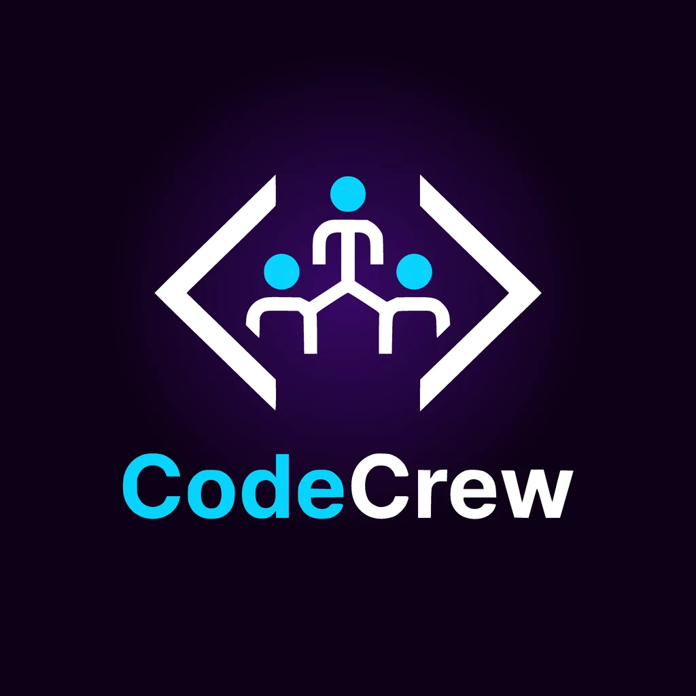
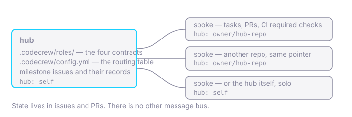
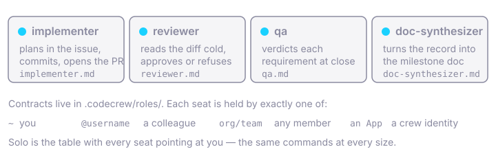
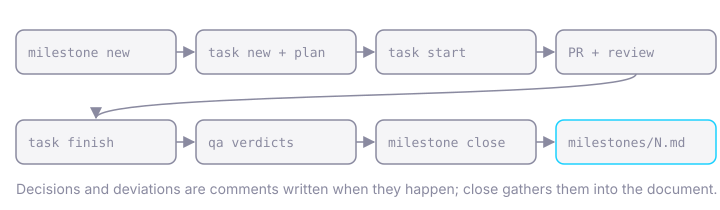
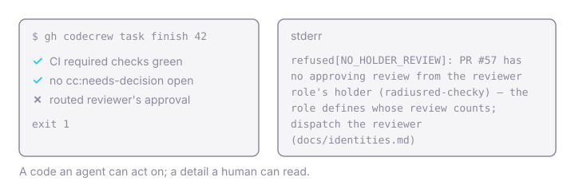

<p align="center">
  
</p>

<p align="center"><strong>Agent-driven software delivery, with the receipts kept in GitHub.</strong></p>

## Why you'd want a crew

You've probably run a coding agent on a real codebase by now. It went well,
mostly — and then three weeks later somebody asked *why* the retry logic
looks like that, and the answer was in a chat transcript nobody saved. The
heavyweight fix is a process framework: planning documents, phase gates, a
directory of state files that drift from the code the moment you stop
looking. The lightweight fix is vibes. Neither hands your colleague an
audit trail.

CodeCrew is a third option, and a small one: **the record is the work.**
Milestones are GitHub issues. Tasks are issues with a plan in them.
Decisions and deviations are comments written at the moment they happen,
in a fixed shape a machine can find later. The gates — CI green, an
independent approval, a human sign-off wherever one was asked for — are
enforced by a CLI that *refuses* rather than reminds. At milestone close,
one role compiles the comments into a document that explains why the
system is the way it is, and that document's PR goes through the same
review as code.

There is no server, no dashboard, no new place to look. It is `gh`,
issues, PRs, and four short role contracts any agent harness can read.

## Start now

Four lines, then one sentence to your agent:

```sh
gh extension install radiusred/gh-codecrew
cd my-project            # any repo on GitHub, brand new or years old
gh codecrew init         # writes .codecrew.yml, roles/, AGENTS.md, CLAUDE.md, ROADMAP.md
claude                   # or codex, or whichever coding agent you run
```

> Let's build this project!

That is the whole onboarding. The scaffold tells the agent it is in a
CodeCrew project and where the contracts are; the contracts give the work
its shape — a milestone issue, tasks with a plan in them, decisions
recorded as they happen, a PR per task; and the verbs refuse when a gate
is not met: `task start` without a plan, `task finish` without green
checks and an independent approval, `milestone close` without a verdict
on every requirement. An agent that follows the shape moves through it
unhindered; one that tries to skip a step meets a refusal it can read.
**You do not run the verbs. Your agent does.** You are needed at three
moments: when a gate asks you a question, when a PR wants your review,
and when a milestone wants your verdict. The record — plans, decisions,
deviations, and the document synthesized from them at close — is what
that workflow leaves behind, not something you maintain.

Two prerequisites worth knowing before the first PR. The repo needs
pull-request CI of some kind, because `task finish` refuses a PR that
reports no checks at all (absence never satisfies a gate). Ten lines of
workflow do; the [quickstart](docs/first-milestone.md#5-finish-the-task)
shows them, and a project that already has CI is done. And `gh` must be
2.50.0 or later — `task finish` reads `gh pr checks --json`, which a
distribution-packaged `gh` may predate; `gh --version` says.

## How it works, in four beats

### 1. A hub, and spokes



One repo is the hub: it holds the role contracts, the routing table (who
holds which seat) and the milestone issues. Every other repo in the project
is a spoke with a two-line pointer file. For a single project, the hub is
the spoke — `hub: self`. State never leaves GitHub, and there is no other
message bus, so any two harnesses interoperate by construction.

### 2. Four seats, always staffed



Implementer, reviewer, qa, doc-synthesizer. Each is a contract — a short
markdown file — not an account. A seat is held by you (`~`), a colleague
by username, a GitHub team, or a GitHub App identity minted for the job.
Solo is not a degraded mode; it is the routing table with every seat
pointing at you. When a project outgrows that, `identity new <role>` mints
a dedicated App through GitHub's manifest flow and reroutes the seat. The
protocol does not change — only the table does. One thing does: an
App-held seat is dispatched, not requested. GitHub drops review requests
to Apps, so whoever coordinates — you, or your platform — starts the
reviewer session when a PR opens, and the implementer stands down after
opening it.

### 3. A milestone, from open to record



`milestone new` opens the tracking issue with its requirements. `task new`
hangs tasks off it; the implementer writes a plan into the task before the
first commit; `task start` cuts the branch; a PR closes the task; `task
finish` is the one merge point. The qa seat posts a verdict per
requirement. `milestone close` gathers the recorded decisions and
deviations for the doc-synthesizer, and refuses to close until the
milestone document exists on the default branch.

### 4. Gates that refuse



A blocked gate exits non-zero with a machine-readable reason:
`refused[NO_CHECKS]` when a PR reports no CI at all (absence does not
satisfy a gate, and there is no override), `refused[NO_HOLDER_REVIEW]`
when the routed reviewer has not approved, `refused[VERDICT_MISSING]` when
a milestone tries to close without a verdict on every requirement,
`refused[EVIDENCE_UNREACHABLE]` when a link the record cites no longer
resolves. An agent acts on the code; a human reads the detail. Those are
four of twenty-three — the [introduction](docs/introduction.md#refusal-codes)
catalogues them all, by the verb that raises each.

## Where it goes from here

Every seat starts routed to you (`~` in `.codecrew.yml`): solo is a
routing configuration, not a reduced protocol. The
[quickstart](docs/first-milestone.md) walks one milestone end to end with
that setup — open it, plan a task, do the work, verdict it, close it,
read the document the close produced. When the project outgrows one
session, the [ladder](docs/first-milestone.md#what-next) is: split the
seats across sessions, give crew members their own App identities, hand
dispatch to an orchestrator. Same commands at every rung; only the
routing table changes. And `gh` never auto-updates extensions —
`gh codecrew version` tells you what you have.

## The receipts

We would rather show you than tell you, so here is what the protocol has
actually done so far.

- **Five milestones of this framework were delivered *with* it** —
  agent-authored PRs under GitHub App identities, independent review,
  deterministic CI gates, QA verdicts enforced at close, and a synthesized
  document for each: [docs/milestones/](docs/milestones/).
- **This repository is agent-staffed, and you can check.** Four App
  identities hold the four seats: cody implements, checky reviews, testy
  verdicts, wordy writes — this page included. PRs here merge on checky's
  approval; a reviewer App minted with write access satisfies GitHub's own
  required-review rule, which is what makes a fully agent-gated merge
  possible ([identities.md](docs/identities.md)).
- **A stranger ran it from the scaffold alone.**
  [davison/numberguess](https://github.com/davison/numberguess) went from
  `gh codecrew init` to three closed milestones with one human and a Codex
  session, transcripts committed, and then served as the proving ground
  for the dedicated reviewer seat.
- **The first spoke published its own announcement.**
  [radiusred/www](https://github.com/radiusred/www) is driven from this
  hub through the installed extension; its first delivery was
  [a blog post introducing CodeCrew, delivered by the protocol it
  describes](https://www.radiusred.uk/blog/posts/2026-08-20-this-post-was-delivered-by-the-framework-it-introduces/).

Things we have not done yet, in the interest of not overselling: any
backend other than GitHub, or GitHub Enterprise Server; a full
orchestration-platform run end to end (it is on the open milestone). The
[roadmap](ROADMAP.md) says which milestone is open and what it is for, and
[CHANGELOG.md](CHANGELOG.md) what each release shipped.

## Read next

- [Introduction](docs/introduction.md) — what CodeCrew is, precisely: the
  protocol, the contracts, the CLI and its refusal codes
- [Your first milestone](docs/first-milestone.md) — the quickstart
- [Identities](docs/identities.md) — running solo, minting App identities,
  dispatching a role session
- [SPEC.md](SPEC.md) — the protocol itself
- [Founding decisions](docs/founding-decisions.md) — the trade-offs, and
  [the essay that started it](docs/gsd-vs-frontier-orchestration.md) — one
  person's experience with GSD across several projects; the motivation,
  not a verdict on GSD

Licensed under [Apache 2.0](LICENSE).
